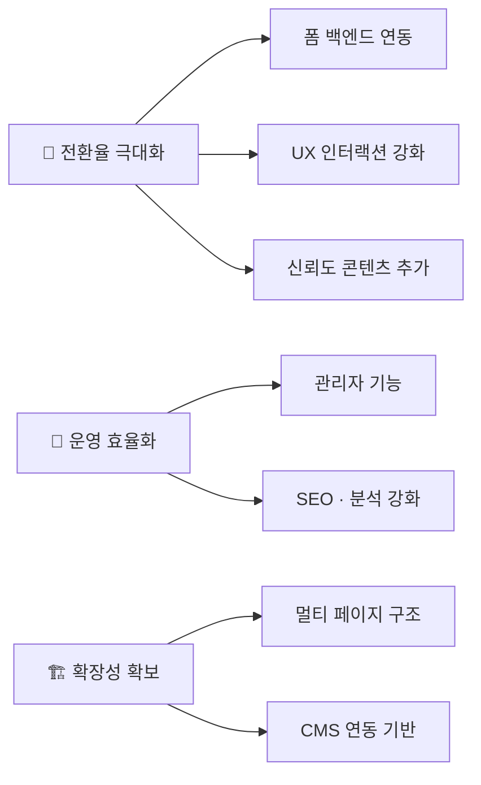
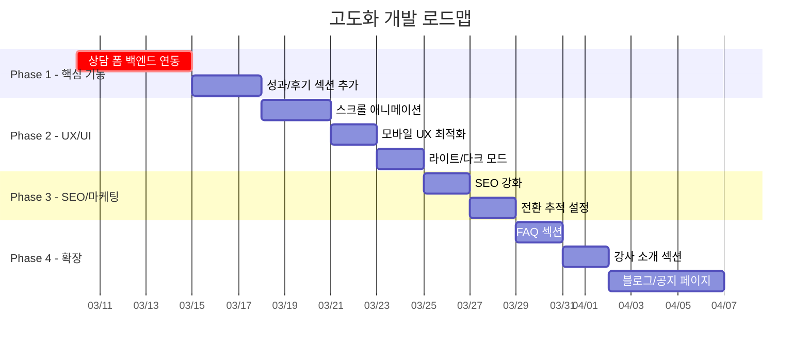

# 하이엔드 과학학원 웹사이트 — 고도화 개발기획서

> **프로젝트명:** 하이엔드 과학학원 랜딩 페이지 v2.0  
> **작성일:** 2026-03-05  
> **기술 스택:** Next.js 16 · React 19 · TailwindCSS 4 · shadcn/ui · Vercel Analytics

---

## 1. 현행 시스템 분석

### 1.1 프로젝트 구조 개요

```
app/
├── globals.css          ← 디자인 토큰 (oklch 다크 테마)
├── layout.tsx           ← 루트 레이아웃 (Geist + Noto Sans KR 폰트)
└── page.tsx             ← 싱글 페이지 엔트리

components/
├── header.tsx           ← 고정 헤더 + 모바일 햄버거 메뉴
├── hero-section.tsx     ← 히어로 섹션 (배경 이미지 + CTA)
├── strengths-section.tsx← 3대 핵심 강점 카드
├── curriculum-section.tsx← 중등부/고등부 커리큘럼 로드맵
├── process-section.tsx  ← 4단계 밀착 관리 프로세스
├── contact-section.tsx  ← 상담 예약 폼 (클라이언트 상태만)
├── footer.tsx           ← 푸터 (사업자 정보)
├── theme-provider.tsx   ← next-themes 프로바이더 (미사용)
└── ui/                  ← shadcn/ui 컴포넌트 57개

hooks/
├── use-mobile.ts
└── use-toast.ts

public/
├── images/              ← 히어로 배경 이미지
└── *.png, *.svg         ← 파비콘, 플레이스홀더
```

### 1.2 현재 기능 현황

| 섹션 | 구현 상태 | 비고 |
|------|----------|------|
| **Header** | ✅ 완료 | 반응형 모바일 메뉴, 앵커 네비게이션 |
| **Hero** | ✅ 완료 | 배경 이미지, 2개 CTA 버튼 |
| **핵심 강점** | ✅ 완료 | 3개 카드 (호버 효과) |
| **커리큘럼** | ✅ 완료 | 중등부/고등부 2컬럼 |
| **관리 프로세스** | ✅ 완료 | 4단계 타임라인 |
| **상담 예약** | ⚠️ 부분 | 폼 UI만 존재, 백엔드 미연동 |
| **Footer** | ✅ 완료 | 최소 정보 노출 |

### 1.3 디자인 시스템

- **컬러:** oklch 기반 다크 테마 전용 (`--primary: oklch(0.78 0.12 75)` — 골드/앰버 톤)
- **폰트:** Noto Sans KR (본문) + Geist (영문) + Geist Mono (코드)
- **레이아웃:** max-w-6xl 중앙 정렬, 반응형 (sm/md/lg 브레이크포인트)
- **미사용 리소스:** ThemeProvider 선언만 있고 실제 다크/라이트 토글 미구현

### 1.4 식별된 한계점

| 분류 | 이슈 | 심각도 |
|------|------|--------|
| **기능** | 상담 폼 데이터가 서버로 전송되지 않음 | 🔴 높음 |
| **기능** | ThemeProvider 미사용 (라이트 모드 미지원) | 🟡 보통 |
| **UX** | 스크롤 애니메이션, 인터랙션 부재 | 🟡 보통 |
| **UX** | 오직 `#` 앵커 이동만 (스무스 스크롤 없음) | 🟡 보통 |
| **SEO** | 동적 메타데이터 없음, 구조화 데이터 미적용 | 🟡 보통 |
| **성능** | 히어로 이미지 최적화 여부 불명확 | 🟢 낮음 |
| **접근성** | 폼 유효성 검사 미구현, ARIA 레이블 부분적 | 🟡 보통 |
| **구조** | 싱글 페이지만 존재, 확장성 제한 | 🟡 보통 |
| **분석** | Vercel Analytics만 사용, 전환 추적 없음 | 🟡 보통 |

---

## 2. 고도화 목표

### 2.1 핵심 목표



---

## 3. 세부 고도화 과제

### Phase 1: 핵심 기능 보완 (우선순위 🔴)

#### 3.1 상담 예약 폼 백엔드 연동

| 항목 | 내용 |
|------|------|
| **현재** | `useState`로 제출 상태만 토글, 데이터가 어디로도 전송되지 않음 |
| **목표** | Server Action 또는 API Route로 데이터 수신 → 이메일 알림 + DB 저장 |
| **기술 방안** | Next.js Server Actions + Resend(이메일) + Supabase/Prisma(DB) |

**구현 세부사항:**
- 폼 유효성 검사 (zod 스키마 — 이미 의존성 설치됨)
- react-hook-form 연동 (이미 의존성 설치됨)
- 에러 핸들링 및 로딩 상태 UI
- 제출 성공/실패 토스트 알림 (sonner — 이미 의존성 설치됨)
- 스팸 방지 (reCAPTCHA 또는 허니팟 필드)

**대상 파일:**
- `[MODIFY]` [contact-section.tsx](file:///c:/Users/yeyoung/Downloads/b_tFWiTV5rOTL-1772708496982/components/contact-section.tsx)
- `[NEW]` `app/actions/submit-consultation.ts` — Server Action
- `[NEW]` `lib/schema.ts` — zod 유효성 검사 스키마

---

#### 3.2 성과/후기 섹션 신규 추가

| 항목 | 내용 |
|------|------|
| **현재** | 학원의 실적 및 수강 후기를 보여주는 섹션 없음 |
| **목표** | 학부모/학생 신뢰도를 높이는 사회적 증거(Social Proof) 섹션 추가 |

**구현 세부사항:**
- 성과 수치 카운터 애니메이션 (예: "1등급 배출 200+명")
- 학부모 후기 캐러셀 (embla-carousel-react — 이미 의존성 설치됨)
- 실제 데이터 기반의 통계 표시

**대상 파일:**
- `[NEW]` `components/testimonials-section.tsx`
- `[NEW]` `components/stats-section.tsx`
- `[MODIFY]` [page.tsx](file:///c:/Users/yeyoung/Downloads/b_tFWiTV5rOTL-1772708496982/app/page.tsx) — 새 섹션 추가

---

### Phase 2: UX/UI 개선 (우선순위 🟡)

#### 3.3 스크롤 애니메이션 · 마이크로 인터랙션

| 항목 | 내용 |
|------|------|
| **현재** | 정적인 페이지, 호버 효과만 일부 적용 |
| **목표** | 섹션 진입 시 fade-in/slide-up 애니메이션, 카운터 애니메이션 |

**구현 세부사항:**
- Intersection Observer 기반 스크롤 트리거 애니메이션
- CSS 애니메이션 + `tw-animate-css` 활용 (이미 설치됨)
- 스무스 스크롤 (`scroll-behavior: smooth`)
- 헤더 스크롤 시 배경 불투명도 변화
- 카드 호버 시 미세한 리프트 효과 강화

**대상 파일:**
- `[NEW]` `hooks/use-intersection-observer.ts`
- `[MODIFY]` 각 섹션 컴포넌트에 애니메이션 클래스 적용
- `[MODIFY]` [globals.css](file:///c:/Users/yeyoung/Downloads/b_tFWiTV5rOTL-1772708496982/app/globals.css) — `scroll-behavior: smooth` 추가

---

#### 3.4 모바일 UX 최적화

| 항목 | 내용 |
|------|------|
| **현재** | 기본 반응형만 구현, 모바일 전용 UX 최적화 부재 |
| **목표** | 모바일 퍼스트 사용성 향상 |

**구현 세부사항:**
- 모바일 하단 고정 CTA 버튼 ("지금 상담 예약")
- 카카오톡 채널 채팅 플로팅 버튼
- 전화 연결 버튼 (`tel:` 링크)
- 터치 친화적 인터랙션 (탭 영역 확대)

**대상 파일:**
- `[NEW]` `components/mobile-cta-bar.tsx`
- `[NEW]` `components/floating-chat-button.tsx`
- `[MODIFY]` [page.tsx](file:///c:/Users/yeyoung/Downloads/b_tFWiTV5rOTL-1772708496982/app/page.tsx)

---

#### 3.5 라이트/다크 모드 지원

| 항목 | 내용 |
|------|------|
| **현재** | 다크 모드 전용 (ThemeProvider 선언만 존재) |
| **목표** | 시스템 설정 기반 자동 전환 + 수동 토글 |

**구현 세부사항:**
- [globals.css](file:///c:/Users/yeyoung/Downloads/b_tFWiTV5rOTL-1772708496982/app/globals.css)에 라이트 모드 CSS 변수 추가
- ThemeProvider를 `layout.tsx`에 적용
- 헤더에 다크/라이트 토글 버튼 추가

**대상 파일:**
- `[MODIFY]` [globals.css](file:///c:/Users/yeyoung/Downloads/b_tFWiTV5rOTL-1772708496982/app/globals.css) — 라이트 모드 변수 추가
- `[MODIFY]` [layout.tsx](file:///c:/Users/yeyoung/Downloads/b_tFWiTV5rOTL-1772708496982/app/layout.tsx) — ThemeProvider 래핑
- `[MODIFY]` [header.tsx](file:///c:/Users/yeyoung/Downloads/b_tFWiTV5rOTL-1772708496982/components/header.tsx) — 토글 버튼

---

### Phase 3: SEO · 마케팅 최적화 (우선순위 🟡)

#### 3.6 SEO 강화

| 항목 | 내용 |
|------|------|
| **현재** | 기본 title/description만 존재 |
| **목표** | 구조화 데이터, Open Graph, 사이트맵, robots.txt 완비 |

**구현 세부사항:**
- JSON-LD 구조화 데이터 (LocalBusiness 스키마)
- Open Graph / Twitter Card 메타태그
- `sitemap.xml` 자동 생성
- `robots.txt` 설정
- 카카오/네이버 미리보기 최적화

**대상 파일:**
- `[MODIFY]` [layout.tsx](file:///c:/Users/yeyoung/Downloads/b_tFWiTV5rOTL-1772708496982/app/layout.tsx) — OG 메타데이터 확장
- `[NEW]` `app/sitemap.ts`
- `[NEW]` `app/robots.ts`
- `[NEW]` `components/structured-data.tsx` — JSON-LD 스크립트

---

#### 3.7 전환 추적 · 분석 강화

| 항목 | 내용 |
|------|------|
| **현재** | Vercel Analytics 기본 세팅만 존재 |
| **목표** | 사용자 행동 분석, 전환 퍼널 추적 |

**구현 세부사항:**
- Google Analytics 4 (GA4) 연동
- 네이버 검색 어드바이저 연동
- 카카오 픽셀 연동
- CTA 클릭, 폼 제출 등 이벤트 트래킹
- UTM 파라미터 추적

**대상 파일:**
- `[NEW]` `lib/analytics.ts` — 이벤트 트래킹 유틸리티
- `[MODIFY]` [layout.tsx](file:///c:/Users/yeyoung/Downloads/b_tFWiTV5rOTL-1772708496982/app/layout.tsx) — 분석 스크립트 추가

---

### Phase 4: 확장 및 콘텐츠 (우선순위 🟢)

#### 3.8 FAQ 섹션 추가

| 항목 | 내용 |
|------|------|
| **현재** | 자주 묻는 질문에 대한 정보 없음 |
| **목표** | 아코디언 형태의 FAQ로 학부모 궁금증 사전 해소 |

**구현 세부사항:**
- Radix Accordion 활용 (이미 의존성 설치됨)
- 수업료, 수업 시간, 정원, 주차 등 주요 질문 10~15개

**대상 파일:**
- `[NEW]` `components/faq-section.tsx`
- `[MODIFY]` [page.tsx](file:///c:/Users/yeyoung/Downloads/b_tFWiTV5rOTL-1772708496982/app/page.tsx)

---

#### 3.9 강사 소개 섹션 추가

| 항목 | 내용 |
|------|------|
| **현재** | "10년+ 베테랑 강사진" 언급만 있고 개별 소개 없음 |
| **목표** | 강사별 프로필 카드로 전문성 어필 |

**구현 세부사항:**
- 강사 사진, 이름, 경력, 전공 과목 카드
- 호버/클릭 시 상세 정보 모달

**대상 파일:**
- `[NEW]` `components/instructors-section.tsx`
- `[MODIFY]` [page.tsx](file:///c:/Users/yeyoung/Downloads/b_tFWiTV5rOTL-1772708496982/app/page.tsx)

---

#### 3.10 블로그/공지사항 페이지

| 항목 | 내용 |
|------|------|
| **현재** | 싱글 페이지만 존재 |
| **목표** | 교육 정보 콘텐츠 및 공지사항 페이지 추가 |

**구현 세부사항:**
- `/blog` 경로에 교육 정보 콘텐츠 (SEO 유입 효과)
- `/notice` 경로에 학원 공지사항
- MDX 기반 콘텐츠 관리 또는 CMS 연동

**대상 파일:**
- `[NEW]` `app/blog/page.tsx`
- `[NEW]` `app/blog/[slug]/page.tsx`
- `[NEW]` `app/notice/page.tsx`

---

## 4. 기술 아키텍처 변경 사항

### 4.1 추가 필요 의존성

| 패키지 | 용도 | 우선순위 |
|--------|------|----------|
| `resend` | 상담 예약 이메일 알림 발송 | 🔴 |
| `@supabase/supabase-js` | 상담 데이터 DB 저장 | 🔴 |
| `framer-motion` | 스크롤 애니메이션, 페이지 전환 | 🟡 |
| `@next/mdx` | 블로그 콘텐츠 관리 | 🟢 |

### 4.2 환경 변수

```env
# 상담 폼 이메일
RESEND_API_KEY=
NOTIFICATION_EMAIL=

# 데이터베이스
SUPABASE_URL=
SUPABASE_ANON_KEY=

# 분석
NEXT_PUBLIC_GA_ID=
NEXT_PUBLIC_NAVER_SITE_VERIFICATION=
```

### 4.3 디렉토리 구조 변경안

```diff
 app/
   globals.css
   layout.tsx
   page.tsx
+  actions/
+    submit-consultation.ts
+  blog/
+    page.tsx
+    [slug]/page.tsx
+  notice/
+    page.tsx
+  sitemap.ts
+  robots.ts

 components/
   header.tsx
   hero-section.tsx
   strengths-section.tsx
   curriculum-section.tsx
   process-section.tsx
   contact-section.tsx
   footer.tsx
+  stats-section.tsx
+  testimonials-section.tsx
+  faq-section.tsx
+  instructors-section.tsx
+  mobile-cta-bar.tsx
+  floating-chat-button.tsx
+  structured-data.tsx

 lib/
   utils.ts
+  schema.ts
+  analytics.ts

 hooks/
   use-mobile.ts
   use-toast.ts
+  use-intersection-observer.ts
```

---

## 5. 우선순위 로드맵



---

## 6. 페이지 구성 변경안 (v2.0)

현재 싱글 페이지의 섹션 순서를 아래와 같이 재구성합니다:

```
┌─────────────────────────────┐
│         Header (고정)        │
├─────────────────────────────┤
│     Hero Section             │  ← 기존 유지
├─────────────────────────────┤
│     Stats Section     [NEW]  │  ← 성과 수치 (1등급 배출 수 등)
├─────────────────────────────┤
│     Strengths Section        │  ← 기존 유지
├─────────────────────────────┤
│     Curriculum Section       │  ← 기존 유지
├─────────────────────────────┤
│     Instructors Section[NEW] │  ← 강사 소개
├─────────────────────────────┤
│     Process Section          │  ← 기존 유지
├─────────────────────────────┤
│  Testimonials Section [NEW]  │  ← 학부모 후기 캐러셀
├─────────────────────────────┤
│     FAQ Section       [NEW]  │  ← 자주 묻는 질문
├─────────────────────────────┤
│     Contact Section          │  ← 기존 + 백엔드 연동
├─────────────────────────────┤
│         Footer               │  ← 기존 유지 + SNS 링크
├─────────────────────────────┤
│   Mobile CTA Bar      [NEW]  │  ← 모바일 하단 고정
│   Floating Chat       [NEW]  │  ← 카카오 채팅 버튼
└─────────────────────────────┘
```

---

## 7. 품질 기준

| 항목 | 기준 |
|------|------|
| **Lighthouse 성능** | 90+ (Performance, Accessibility, SEO) |
| **Core Web Vitals** | LCP < 2.5s, FID < 100ms, CLS < 0.1 |
| **반응형** | 320px ~ 1440px 전 구간 정상 표시 |
| **브라우저** | Chrome, Safari, Firefox, Edge 최신 2버전 |
| **접근성** | WCAG 2.1 AA 준수 |

---

> [!NOTE]
> 이 기획서는 현재 코드 분석을 기반으로 작성되었습니다. 실제 콘텐츠(강사 정보, 후기, 성과 수치 등)와 백엔드 인프라(DB, 이메일 서비스) 설정은 운영 담당자의 정보 제공이 필요합니다.
